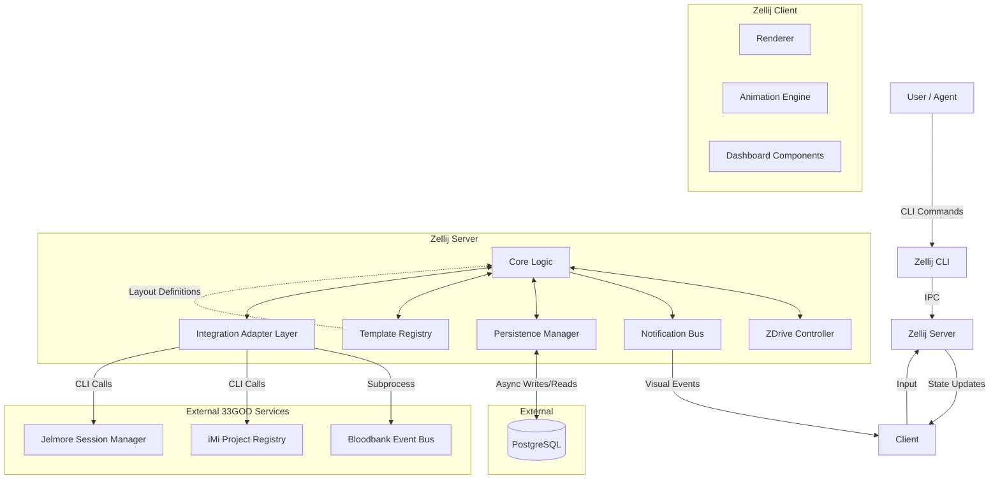
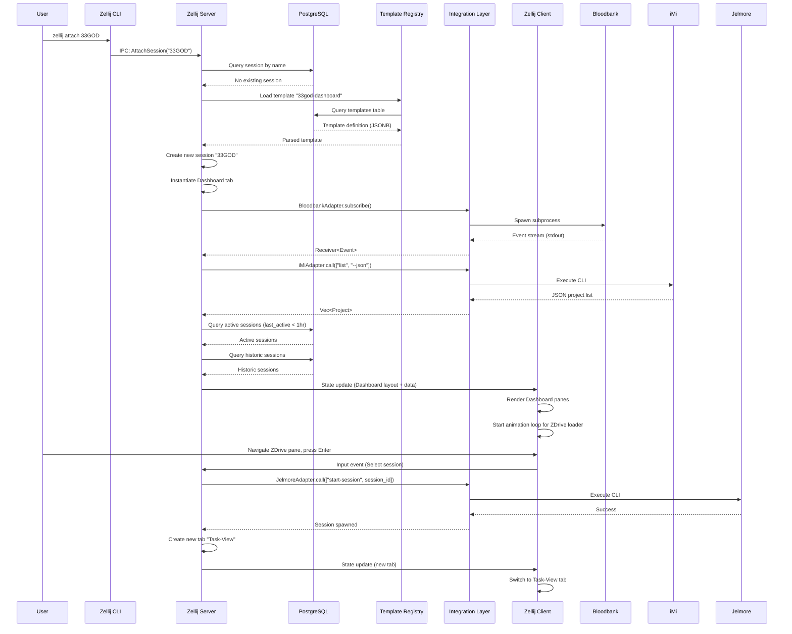

# System Architecture: Perth (33GOD IDE)

**Date:** 2026-01-22
**Architect:** 33GOD/Delorenj
**Version:** 2.0
**Project Type:** Terminal IDE / Multiplexer Fork
**Project Level:** 2
**Status:** Draft

---

## Document Overview

This document defines the system architecture for the Zellij Fork tailored for the 33GOD ecosystem. It provides the technical blueprint for implementing native agent notifications, integrated CLI control (`zdrive`), PostgreSQL-backed session persistence, and a structured Dashboard interface that integrates with external 33GOD services (Bloodbank, iMi, Jelmore).

**Related Documents:**
- Product Requirements Document: /home/delorenj/code/33GOD/perth/docs/prd-perth-2026-01-22.md
- Milestone 1 Acceptance: /home/delorenj/code/33GOD/perth/docs/milestone-1-acceptance.md

---

## Executive Summary

The architecture extends the existing Zellij terminal multiplexer by embedding new core subsystems directly into the `zellij-server` and `zellij-client` crates:

1. **NotificationBus** - Visual alerts and animations
2. **ZDriveController** - Native programmatic control
3. **PersistenceManager** - PostgreSQL session persistence
4. **Dashboard System** - Structured, multi-pane interface integrating Bloodbank, iMi, and ZDrive
5. **Integration Layer** - Adapters for external 33GOD CLI tools
6. **Template Registry** - Predefined layout patterns (Dashboard, Task-View)

This design eliminates external wrapper scripts and fragile plugin interactions, ensuring high performance and reliability for multi-agent workflows while providing a unified entry point for 33GOD ecosystem operations.

---

## Architectural Drivers

These requirements heavily influence architectural decisions:

### Core Infrastructure Drivers

1. **Low Latency (NFR-001):** Agent notifications and CLI commands must feel instantaneous (<50ms). This dictates tight integration with the main event loop rather than external polling mechanisms.

2. **Session Reliability (NFR-003):** The system must recover from crashes or restarts without data loss. This requires a robust, transactional persistence layer (PostgreSQL) rather than flat files.

3. **Backward Compatibility (NFR-002):** The fork must continue to function as a standard terminal multiplexer for non-33GOD use cases, implying that new features should be additive and configurable.

### Dashboard & Integration Drivers (Milestone 1)

4. **Default Entry Experience:** 33GOD sessions must launch with a pre-configured Dashboard tab, not blank terminals. This requires a template system and initialization logic.

5. **Multi-System Orchestration:** Dashboard integrates disparate 33GOD services (Bloodbank event bus, iMi project registry, ZDrive session manager) into a unified view. This requires clean integration boundaries and error isolation.

6. **Stateful UI Components:** Panes evolve from simple PTY wrappers to stateful, interactive components with business logic (pagination, selection, animations). This requires component state management beyond terminal scrollback.

7. **Real-Time Event Streams:** Bloodbank feed requires continuous subscription to RabbitMQ events, not polling. This requires long-running subprocess management and stream parsing.

8. **Template-Driven Layouts:** Need reproducible, named layout patterns (Dashboard, Task-View) stored and instantiated programmatically. This requires a template registry and layout engine.

---

## System Overview

### High-Level Architecture

The system retains the client-server model of Zellij with significant extensions:

- **zellij-server**: Source of truth for pane state, PTYs, database persistence, notification routing, Dashboard component orchestration, and external integration management.
- **zellij-client**: Rendering engine for terminal output, visual overlays, animations, and specialized Dashboard pane components.

### Extended Architecture Diagram



### Architectural Pattern

**Pattern:** Modular Monolith with Event-Driven Extensions + Adapter Integration Layer

**Rationale:**
- Zellij is already a modular monolith. We extend specific modules (Server, Client) and introduce new internal event flows (Notifications, Persistence) without breaking the monolithic deployment model (single binary).
- The Dashboard and external integrations follow an **Adapter pattern** to isolate 33GOD-specific logic from core Zellij functionality, maintaining backward compatibility.
- Template-driven layouts enable reproducible UI patterns without hardcoding Dashboard logic into core rendering.

---

## Dashboard Architecture

### Overview

The Dashboard is the default entry point for 33GOD sessions. It consists of a predefined tab with three specialized panes, each rendering data from external 33GOD services.

### Dashboard Layout Template

**Template Name:** `33god-dashboard`
**Tab Name:** "Dashboard"
**Pane Configuration:**

```
┌──────────────────────────────────────┐
│         Bloodbank Event Feed         │
│                                      │
│  [Real-time event stream display]   │
│                                      │
├──────────────────────────────────────┤
│        iMi Project Browser           │
│                                      │
│  [Project list with pagination]     │
│                                      │
├──────────────────────────────────────┤
│       ZDrive Session Browser         │
│                                      │
│  [Active/Historic sessions + anim]   │
│                                      │
└──────────────────────────────────────┘
```

### Pane Components

#### 1. Bloodbank Event Feed Pane

**Component Type:** `StreamSubscriberPane`
**Responsibility:** Subscribe to Bloodbank RabbitMQ event stream and render events in real-time.

**Implementation:**
- Spawns subprocess: `bloodbank subscribe --format json`
- Parses newline-delimited JSON events
- Renders event list with scrollback
- Read-only (no user interaction in Milestone 1)

**State:**
- `events: Vec<Event>` - Buffered events (last 100)
- `scroll_offset: usize` - Current scroll position

**Dependencies:**
- Bloodbank CLI (external)
- `serde_json` for parsing

#### 2. iMi Project Browser Pane

**Component Type:** `ListBrowserPane`
**Responsibility:** Display registered iMi projects with pagination.

**Implementation:**
- On initialization: `imi list --json` (one-time query)
- Caches results in memory
- Renders paginated list (5 items per page)
- Hotkey navigation (j/k for scroll, h/l for pagination)

**State:**
- `projects: Vec<Project>` - Cached project list
- `current_page: usize` - Pagination state
- `selected_index: usize` - Cursor position

**Data Model:**
```rust
struct Project {
    name: String,
    description: String,
    last_active: DateTime<Utc>,
}
```

**Dependencies:**
- iMi CLI (external)
- `serde_json` for parsing

#### 3. ZDrive Session Browser Pane

**Component Type:** `SessionBrowserPane`
**Responsibility:** Display active and historic ZDrive sessions with animated indicators for active sessions.

**Implementation:**
- Queries local ZDrive PostgreSQL DB (same DB as Persistence Manager)
- Displays two sections:
  - **Active Sessions** (top) - With animated "candycane" loader
  - **Historic Sessions** (bottom) - Static list, ordered by recency
- Hotkey navigation (j/k for scroll, Enter for selection)
- Selection triggers Jelmore to spawn/resume Task-View session

**State:**
- `active_sessions: Vec<Session>` - Sessions with `last_active` < 1 hour
- `historic_sessions: Vec<Session>` - Older sessions
- `selected_index: usize` - Cursor position
- `animation_frame: usize` - Current frame for loader animation

**Animation:**
- Horizontal "candycane" pattern (lightgreen/darkgreen cycling)
- Implemented via Animation Engine
- Pattern: `█▓▒░░▒▓█` repeating, shifting 1 cell per frame (60fps)

**Dependencies:**
- ZDrive DB (local PostgreSQL)
- Jelmore CLI (external, for session activation)

---

## Integration Layer

### Purpose

The Integration Layer provides a clean abstraction for interacting with external 33GOD CLI tools (Bloodbank, iMi, Jelmore). It isolates subprocess management, error handling, and data parsing from Dashboard component logic.

### Design

**Module:** `zellij-server/src/integrations/`

**Components:**

#### 1. Integration Adapter Interface

```rust
#[async_trait]
trait IntegrationAdapter {
    async fn call(&self, args: &[&str]) -> Result<String, IntegrationError>;
    async fn subscribe(&self, args: &[&str]) -> Result<Receiver<String>, IntegrationError>;
}
```

**Implementations:**
- `BloodbankAdapter` - Manages `bloodbank subscribe` subprocess
- `iMiAdapter` - Executes `imi list --json` and parses
- `JelmoreAdapter` - Executes `jelmore start-session` and `jelmore resume-session`

#### 2. Subprocess Manager

**Responsibility:** Spawn and monitor long-running subprocesses (e.g., Bloodbank subscriber).

**Features:**
- Health checks (detect subprocess crashes)
- Automatic restart with exponential backoff
- Graceful shutdown on pane close

**Implementation:**
- Wraps `tokio::process::Command`
- Uses `tokio::select!` for concurrent stdout/stderr reading

#### 3. JSON Parser

**Responsibility:** Parse CLI output into strongly-typed structs.

**Dependencies:**
- `serde_json` for JSON parsing
- `serde` derives on data models

### Error Handling

**Strategy:** Fail gracefully without crashing Zellij.

**Behavior:**
- If Bloodbank subprocess crashes: Display error message in pane, offer manual restart
- If iMi CLI not found: Display "iMi not installed" message
- If Jelmore session spawn fails: Show error toast, keep session browser functional

**Isolation:** Each adapter operates independently. Failure in one does not affect others.

---

## Template System

### Purpose

Enable predefined, reproducible layout patterns (Dashboard, Task-View) that can be instantiated programmatically.

### Design

**Module:** `zellij-server/src/templates/`

#### Template Registry

**Storage:** Templates stored as YAML files in `/home/delorenj/.config/zellij/templates/` and as JSONB in PostgreSQL (`templates` table).

**Schema:**
```yaml
name: "33god-dashboard"
tabs:
  - name: "Dashboard"
    panes:
      - type: "bloodbank-feed"
        position: { x: 0, y: 0, width: 100%, height: 33% }
      - type: "imi-browser"
        position: { x: 0, y: 33%, width: 100%, height: 33% }
      - type: "zdrive-browser"
        position: { x: 0, y: 66%, width: 100%, height: 34% }
```

**Pane Types:**
- `terminal` - Standard PTY-backed pane
- `bloodbank-feed` - Bloodbank Event Feed Component
- `imi-browser` - iMi Project Browser Component
- `zdrive-browser` - ZDrive Session Browser Component

#### Template Instantiation

**Trigger:** `zellij attach 33GOD` or `zellij attach --template 33god-dashboard`

**Process:**
1. Template Registry loads `33god-dashboard.yaml`
2. Server creates tab "Dashboard"
3. For each pane in template:
   - If type is `terminal`: Spawn PTY with configured command
   - If type is specialized component: Initialize component state, spawn subprocess if needed
4. Client receives layout update, renders Dashboard

**Persistence:** When session is saved to DB, template name is stored in `sessions.template_name`. On recovery, template is re-instantiated.

---

## System Components

### Core Components (Existing)

#### 1. ZDrive Controller (`zellij-server`)
- **Responsibility:** Handles high-level commands to manipulate the workspace (create tab, rename pane, inject input).
- **Interface:** Exposes internal API endpoints callable via the CLI.
- **Key Logic:** Translates "user intent" (e.g., "focus tab X") into internal Zellij `Action`s.
- **FRs Addressed:** FR-002, FR-003

#### 2. Notification Bus (`zellij-server` & `zellij-client`)
- **Responsibility:** Routes notification events from external triggers to the rendering engine.
- **Server Side:** Receives `Notify` actions, updates pane state metadata.
- **Client Side:** Interprets metadata to trigger visual effects.
- **FRs Addressed:** FR-001

#### 3. Persistence Manager (`zellij-server`)
- **Responsibility:** Syncs in-memory state to PostgreSQL.
- **Strategy:** "Write-Behind" caching. State changes are queued and written to DB asynchronously to avoid blocking the main thread.
- **Recovery:** On startup, if a `session_id` is provided, it reconstructs the in-memory state from the DB.
- **FRs Addressed:** FR-004

#### 4. Animation Engine (`zellij-client`)
- **Responsibility:** Renders frame-based animations for UI elements.
- **Implementation:** Lightweight loop within the client's render cycle that modifies cell styles (bg/fg colors) based on time-decay functions or state-driven patterns (e.g., candycane loader).
- **FRs Addressed:** FR-005

### Dashboard Components (New)

#### 5. Bloodbank Event Feed Component (`zellij-client`)
- **Responsibility:** Render real-time Bloodbank events in a scrollable list.
- **State Management:** Maintains event buffer (last 100 events), scroll position.
- **Integration:** Uses `BloodbankAdapter` to subscribe to event stream.
- **Milestone:** M1

#### 6. iMi Project Browser Component (`zellij-client`)
- **Responsibility:** Display paginated iMi project list with navigation.
- **State Management:** Caches project list, tracks pagination and cursor state.
- **Integration:** Uses `iMiAdapter` to query project registry.
- **Milestone:** M1

#### 7. ZDrive Session Browser Component (`zellij-client`)
- **Responsibility:** Display active/historic sessions with animations and selection.
- **State Management:** Queries ZDrive DB, maintains session list and animation frames.
- **Integration:** Uses ZDrive DB (local) and `JelmoreAdapter` for session activation.
- **Milestone:** M1

#### 8. Template Registry (`zellij-server`)
- **Responsibility:** Load, parse, and instantiate layout templates.
- **Storage:** YAML files + PostgreSQL `templates` table.
- **API:** `TemplateRegistry::load(name)`, `TemplateRegistry::instantiate(session_id, template)`
- **Milestone:** M1

#### 9. Integration Adapter Layer (`zellij-server`)
- **Responsibility:** Abstract subprocess management and CLI interactions for external 33GOD tools.
- **Components:** `BloodbankAdapter`, `iMiAdapter`, `JelmoreAdapter`
- **Error Handling:** Fail gracefully, isolate errors per adapter.
- **Milestone:** M1

---

## Data Architecture

### Data Model (PostgreSQL)

#### Existing Tables

**Table: `sessions`**
- `id` (UUID, PK)
- `name` (Text)
- `template_name` (Text, nullable) - **NEW:** Name of template used
- `created_at` (Timestamp)
- `last_active` (Timestamp)

**Table: `tabs`**
- `id` (UUID, PK)
- `session_id` (UUID, FK)
- `position` (Int)
- `name` (Text)
- `layout_blob` (JSONB) - Snapshot of layout config

**Table: `panes`**
- `id` (UUID, PK)
- `tab_id` (UUID, FK)
- `pane_id` (Int) - Internal Zellij ID
- `pane_type` (Text) - **NEW:** `terminal`, `bloodbank-feed`, `imi-browser`, `zdrive-browser`
- `component_state` (JSONB, nullable) - **NEW:** Component-specific state (pagination, scroll offset, etc.)
- `title` (Text)
- `cwd` (Text)
- `command` (Text, nullable)

**Table: `pane_history`**
- `pane_id` (UUID, FK)
- `chunk_index` (Int)
- `content` (ByteA) - Compressed scrollback data

#### New Tables

**Table: `templates`**
- `id` (UUID, PK)
- `name` (Text, unique) - Template identifier (e.g., `33god-dashboard`)
- `definition` (JSONB) - Full template YAML parsed to JSON
- `created_at` (Timestamp)
- `updated_at` (Timestamp)

**Indexes:**
- `sessions.name` (B-tree, for fast session lookup by name)
- `sessions.last_active` (B-tree, for historic session ordering)
- `templates.name` (unique B-tree)

### Data Flow: Dashboard User Journey

**Scenario:** User launches 33GOD session for the first time.



---

## Technology Stack

### Core
- **Language:** Rust (Edition 2021)
- **Runtime:** Tokio (Async runtime used by Zellij)

### Database
- **Engine:** PostgreSQL 16+
- **Driver:** `sqlx` (Rust async SQL crate with compile-time query verification)
- **Migration Manager:** `sqlx-cli`

**Rationale:**
- PostgreSQL provides robust concurrency, JSONB support for flexible schemas (templates, component state), and is already a dependency of the 33GOD ecosystem.
- `sqlx` offers type-safe queries and async support, aligning with Tokio runtime.

### Interface
- **CLI:** `clap` (Existing Zellij CLI framework, v4+)
- **IPC:** Unix Domain Sockets (Existing Zellij IPC)

### Integration Layer
- **Subprocess Management:** `tokio::process::Command`
- **JSON Parsing:** `serde_json` v1.0+
- **YAML Parsing:** `serde_yaml` v0.9+ (for template files)

**Rationale:**
- Tokio's process module provides async subprocess management, fitting naturally into Zellij's event loop.
- `serde` ecosystem is the Rust standard for serialization, well-tested and performant.

### Template Storage
- **File Format:** YAML (human-editable, version-controllable)
- **Database Storage:** JSONB (for fast query and persistence)

**Trade-off:**
- YAML for developer experience (easy to write templates)
- JSONB for runtime efficiency (no repeated parsing)

---

## API Design

### Internal CLI Extensions

The `zellij` binary will support new subcommands:

#### 1. Notify

```bash
zellij notify --pane-id <ID> --style <error|success|warning> --message <Text>
```

**Example:**
```bash
zellij notify --pane-id 3 --style error --message "Build failed"
```

**FRs Addressed:** FR-001

#### 2. Drive

```bash
zellij drive create-tab --name <Name> --layout <Path>
zellij drive inject-text --pane-id <ID> --text <Content>
zellij drive rename-pane --pane-id <ID> --name <Name>
```

**Examples:**
```bash
zellij drive create-tab --name "Build" --layout ~/.config/zellij/layouts/build.yaml
zellij drive inject-text --pane-id 2 --text "npm run build\n"
```

**FRs Addressed:** FR-002, FR-003

#### 3. Template (New)

```bash
zellij template list
zellij template show <name>
zellij template create --name <name> --file <path>
zellij attach --template <name>
```

**Examples:**
```bash
zellij template list
zellij template show 33god-dashboard
zellij attach --template 33god-dashboard
```

**Purpose:** Manage layout templates programmatically.

### Component State API (Internal)

Dashboard components expose methods for state updates:

```rust
trait DashboardComponent {
    fn handle_input(&mut self, key: Key) -> ComponentAction;
    fn render(&self, area: Rect) -> Vec<Line>;
    fn update_data(&mut self, data: ComponentData);
}

enum ComponentAction {
    None,
    FocusNext,
    FocusPrev,
    Select(usize),
    Scroll(isize),
}
```

**Example:** ZDrive Session Browser

```rust
impl DashboardComponent for ZDriveSessionBrowser {
    fn handle_input(&mut self, key: Key) -> ComponentAction {
        match key {
            Key::Char('j') => ComponentAction::Scroll(1),
            Key::Char('k') => ComponentAction::Scroll(-1),
            Key::Enter => ComponentAction::Select(self.selected_index),
            _ => ComponentAction::None,
        }
    }

    fn render(&self, area: Rect) -> Vec<Line> {
        // Render active sessions with animation
        // Render historic sessions
    }

    fn update_data(&mut self, data: ComponentData) {
        // Update session list from DB query
    }
}
```

---

## Non-Functional Requirements Coverage

### NFR-001: Performance Overhead
**Requirement:** <5ms latency increase.

**Solution:**
- Database writes are strictly asynchronous (fire-and-forget or queued).
- Animation rendering is limited to dirty regions of the screen.
- Dashboard component queries are cached (iMi list, ZDrive sessions) with TTL-based invalidation.
- Bloodbank event stream uses bounded channel to prevent unbounded memory growth.

**Validation:**
- Benchmark input latency before/after Dashboard implementation.
- Target: <2ms average latency increase for standard terminal input.

### NFR-002: Compatibility
**Requirement:** Backward compatibility with standard Zellij usage.

**Solution:**
- Persistence layer is optional. If no DB connection string is provided, Zellij reverts to ephemeral RAM-only mode.
- Dashboard template is only loaded if explicitly requested (`--template` flag or session name matches registered template).
- Default behavior (`zellij attach`) remains unchanged (blank terminal).

**Validation:**
- Run standard Zellij regression tests.
- Ensure no crashes when PostgreSQL is unavailable.

### NFR-003: Database Reliability
**Requirement:** Graceful failure on DB outage.

**Solution:**
- `PersistenceManager` wraps DB calls in `Result` blocks.
- If DB is unreachable: Logs error to `stderr`, disables persistence for the session, falls back to standard behavior.
- Integration adapters handle subprocess crashes with automatic restart (3 retries with exponential backoff).

**Validation:**
- Integration test: Kill PostgreSQL during session, verify Zellij continues to function.
- Integration test: Kill Bloodbank subprocess, verify error message + manual restart option.

### Additional NFRs (Derived from Milestone 1)

#### NFR-004: Component Responsiveness
**Requirement:** Dashboard panes must respond to user input within 50ms.

**Solution:**
- Component input handling runs synchronously in client render thread.
- Background data updates (DB queries, subprocess reads) are async and non-blocking.

**Validation:**
- Measure key press to visual update latency for pagination, scroll, selection.

#### NFR-005: Integration Error Isolation
**Requirement:** Failure in one external integration must not crash Zellij or affect other components.

**Solution:**
- Each Integration Adapter runs in isolated task.
- Errors are caught at adapter boundary, logged, and displayed in affected pane only.

**Validation:**
- Integration test: Simulate `imi` CLI missing, verify only iMi pane shows error, others continue to function.

---

## Security Architecture

### Authentication
Not applicable (local-only system, no network exposure in Milestone 1).

### Authorization
Not applicable (single-user system).

### Data Protection

#### Database Security
- **Connection:** PostgreSQL connection string stored in `~/.config/zellij/config.yaml` (user-readable only, chmod 600).
- **Credentials:** Use PostgreSQL peer authentication (Unix socket) or password authentication with credentials in config file.
- **Encryption at Rest:** Relies on PostgreSQL encryption (optional, not enforced by Zellij).

#### Subprocess Security
- **Command Injection:** All CLI arguments are passed as Vec<String>, not shell strings. Uses `Command::arg()`, not shell interpolation.
- **Privilege Escalation:** Subprocesses inherit user permissions, no elevation.

### External Integration Security

**Bloodbank Subscriber:**
- Subprocess reads RabbitMQ events via standard Bloodbank CLI, no direct socket access.
- Event data is untrusted; display only, no execution.

**iMi / Jelmore:**
- CLI calls use fixed arguments, no user-provided shell commands.
- JSON parsing uses `serde_json`, which handles malformed input gracefully (returns error, does not crash).

**Threat Model:**
- **Malicious Event in Bloodbank:** Could display misleading information, but cannot execute code.
- **Malicious JSON from iMi:** Could cause parsing error, displayed as "Parse error" in pane.

**Mitigation:**
- Sandbox future iterations with stricter input validation.
- Rate-limit Bloodbank events to prevent UI flooding.

---

## Scalability & Performance

### Scaling Strategy

**Single-User System:** Perth is designed for local, single-user workloads. No horizontal scaling required.

**Vertical Scaling:**
- Database query optimization (indexed lookups on `sessions.last_active`, `templates.name`).
- Component data caching reduces DB query frequency.

**Performance Targets:**
- Dashboard launch: <500ms from `zellij attach` to rendered panes.
- Session browser query: <100ms for 1000 sessions.
- Bloodbank event rendering: Handle 100 events/sec without UI lag.

### Performance Optimization

**Query Optimization:**
- Index `sessions.last_active` for fast active session filtering.
- Use `LIMIT` on historic sessions (show last 20 only).

**Caching Strategy:**
- **iMi Project List:** Cache for 5 minutes, refresh on manual trigger (hotkey).
- **ZDrive Sessions:** Refresh every 30 seconds via background task.
- **Bloodbank Events:** No caching (real-time stream).

**Animation Optimization:**
- ZDrive candycane loader: Update only affected cells (horizontal bar), not full pane.
- Target 60fps, degrade to 30fps if CPU usage >80%.

### Load Balancing
Not applicable (single-process system).

---

## Reliability & Availability

### High Availability
Not applicable (local-only system, no HA requirements).

### Disaster Recovery

**Session Recovery:**
- **RPO (Recovery Point Objective):** 1 second (write-behind cache flush interval).
- **RTO (Recovery Time Objective):** 5 seconds (session restore from DB).

**Backup Strategy:**
- PostgreSQL daily backups via `pg_dump` (user responsibility, not built into Perth).
- Template files stored in `~/.config/zellij/templates/`, version-controlled via Git (recommended).

**Restore Procedures:**
- Session restore: `zellij attach --session-id <UUID>` (reads from DB).
- Template restore: `git pull` (if version-controlled) or manual file recovery.

### Monitoring & Alerting

**Logging Strategy:**
- Structured logging via `tracing` crate (Zellij standard).
- Log levels: `ERROR` for unrecoverable failures, `WARN` for degraded state (DB unreachable), `INFO` for lifecycle events (session created, template loaded).

**Metrics:**
- Not implemented in Milestone 1.
- Future: Expose Prometheus metrics for session count, DB query latency, subprocess health.

**Alerting:**
- No external alerting system.
- In-app notifications: Display toast for critical errors (DB connection lost, integration adapter crashed).

---

## Development & Deployment

### Code Organization

**Extended Module Structure:**

```
zellij-server/src/
  persistence/
    mod.rs
    manager.rs       # PersistenceManager
    schema.sql       # DB migrations
  zdrive/
    mod.rs
    controller.rs    # ZDriveController
  integrations/
    mod.rs
    adapter.rs       # IntegrationAdapter trait
    bloodbank.rs     # BloodbankAdapter
    imi.rs           # iMiAdapter
    jelmore.rs       # JelmoreAdapter
    subprocess.rs    # SubprocessManager
  templates/
    mod.rs
    registry.rs      # TemplateRegistry
    parser.rs        # YAML -> Template struct
  notifications/
    mod.rs
    bus.rs           # NotificationBus

zellij-client/src/
  animation/
    mod.rs
    engine.rs        # AnimationEngine
    candycane.rs     # Candycane loader pattern
  components/
    mod.rs
    dashboard/
      mod.rs
      bloodbank_feed.rs   # Bloodbank Event Feed Component
      imi_browser.rs      # iMi Project Browser Component
      zdrive_browser.rs   # ZDrive Session Browser Component
    trait.rs         # DashboardComponent trait
```

### Testing Strategy

#### Unit Tests
- `PersistenceManager`: Mock DB with `sqlx::MockDatabase`.
- `TemplateRegistry`: Test YAML parsing, template instantiation logic.
- `IntegrationAdapter`: Mock subprocess with fake CLI scripts.
- `DashboardComponent`: Test input handling, rendering logic.

**Coverage Target:** 80%+ for new modules.

#### Integration Tests
- **Full Session Lifecycle:** Create session, attach, persist, detach, recover.
- **Dashboard Launch:** `zellij attach --template 33god-dashboard`, verify 3 panes rendered.
- **Bloodbank Integration:** Mock `bloodbank subscribe` with script emitting fake events, verify rendering.
- **iMi Integration:** Mock `imi list` with JSON fixture, verify pagination.
- **Template Instantiation:** Load template from DB, verify correct pane types.

**Test Environment:**
- Dockerized PostgreSQL for DB tests.
- Fake CLI scripts in `tests/fixtures/` for integration adapter tests.

#### End-to-End Tests
- **Milestone 1 Acceptance:** Automate the Milestone 1 scenario (attach 33GOD session, navigate ZDrive browser, select session).
- Manual testing: Launch real Bloodbank, iMi, Jelmore services, verify Dashboard functionality.

### CI/CD Pipeline

**Pipeline Stages:**
1. **Build** - `cargo build --release`
2. **Test** - `cargo test` (unit + integration)
3. **Lint** - `cargo clippy`, `cargo fmt --check`
4. **DB Migrations** - `sqlx migrate run` (validate schema)
5. **Package** - Build binary, create tarball

**Deployment:**
- Local installation: `cargo install --path .`
- Binary distribution: GitHub Releases (manual for Milestone 1)

### Environments

**Development:**
- Local PostgreSQL (Docker or native)
- Mock Bloodbank/iMi/Jelmore CLIs (test fixtures)

**Staging:**
- Full 33GOD stack (Bloodbank, iMi, Jelmore) running in Docker Compose
- Shared PostgreSQL instance

**Production:**
- User's local machine
- User-managed PostgreSQL instance
- User-managed 33GOD services

**Configuration Management:**
- Config file: `~/.config/zellij/config.yaml`
- Environment variables: `ZELLIJ_DB_URL` (overrides config)

---

## Trade-offs & Decision Log

### Decision: PostgreSQL vs. SQLite
**Trade-off:**
- **Gain:** Better concurrency, JSONB support, alignment with 33GOD ecosystem.
- **Lose:** Higher setup complexity, external dependency.

**Rationale:** 33GOD ecosystem already relies on Postgres; adding SQLite would introduce a second DB engine to manage. JSONB support simplifies template and component state storage.

### Decision: Native Rust Integration vs. External Plugin
**Trade-off:**
- **Gain:** High performance, deep rendering access, tight event loop integration.
- **Lose:** Requires maintaining a fork, upstream compatibility burden.

**Rationale:** The plugin API limits access to low-level rendering and event loops required for high-performance animations and deep state control. Dashboard components need more than plugins can provide.

### Decision: Template Storage (YAML + JSONB)
**Trade-off:**
- **Gain:** Human-editable templates (YAML), fast runtime queries (JSONB).
- **Lose:** Dual storage, sync complexity.

**Rationale:** YAML prioritizes developer experience (version-controlled templates). JSONB prioritizes runtime efficiency (no repeated parsing). Templates are rarely modified, so sync is not a bottleneck.

### Decision: Integration Adapter Layer vs. Direct CLI Calls
**Trade-off:**
- **Gain:** Clean abstraction, error isolation, testability.
- **Lose:** Additional code layer, minor indirection overhead.

**Rationale:** Direct CLI calls scatter subprocess logic across components, making error handling fragile. Adapter layer centralizes this logic, simplifies testing (mock adapters), and isolates failures.

### Decision: Component State in PostgreSQL vs. In-Memory Only
**Trade-off:**
- **Gain:** Component state survives restarts (pagination position, scroll offset).
- **Lose:** More DB writes, schema complexity.

**Rationale:** For Milestone 1, component state persistence is nice-to-have but not critical. We persist to JSONB column for consistency but don't prioritize recovery (state resets on restart acceptable for MVP). Future optimization: make persistence optional per component.

### Decision: Bloodbank Stream via Subprocess vs. Direct RabbitMQ Client
**Trade-off:**
- **Gain:** Decoupling (use existing `bloodbank subscribe` CLI), simpler integration.
- **Lose:** Subprocess overhead, no direct control over reconnection logic.

**Rationale:** Reusing `bloodbank subscribe` avoids duplicating RabbitMQ connection logic in Perth. Subprocess overhead is negligible for a single event stream. Future optimization: Embed `amqprs` client if subprocess proves brittle.

---

## FR/NFR Traceability

### Functional Requirements Traceability

| FR ID | FR Name | Components | Milestone |
|-------|---------|------------|-----------|
| FR-001 | Native Visual Notifications | NotificationBus, Animation Engine | Core |
| FR-002 | Integrated CLI Control | ZDrive Controller, CLI Extensions | Core |
| FR-003 | Programmatic Input Injection | ZDrive Controller | Core |
| FR-004 | Postgres-Backed Session Persistence | Persistence Manager, DB Schema | Core |
| FR-005 | Advanced UI Animations | Animation Engine, ZDrive Browser Component | Core + M1 |
| (Implicit) | Dashboard Entry Point | Template Registry, Dashboard Components | M1 |
| (Implicit) | Bloodbank Integration | Bloodbank Adapter, Bloodbank Feed Component | M1 |
| (Implicit) | iMi Integration | iMi Adapter, iMi Browser Component | M1 |
| (Implicit) | ZDrive UI | ZDrive Browser Component, ZDrive DB | M1 |
| (Implicit) | Jelmore Integration | Jelmore Adapter | M1 |

### Non-Functional Requirements Traceability

| NFR ID | NFR Name | Solution | Validation |
|--------|----------|----------|------------|
| NFR-001 | Performance Overhead (<5ms) | Async DB writes, dirty region rendering, caching | Benchmark input latency |
| NFR-002 | Compatibility | Optional persistence, conditional Dashboard | Regression tests, no-DB tests |
| NFR-003 | Database Reliability | Graceful failure, fallback to ephemeral mode | DB kill test, subprocess crash test |
| NFR-004 | Component Responsiveness (<50ms) | Sync input handling, async data updates | Key-to-visual latency measurement |
| NFR-005 | Integration Error Isolation | Isolated adapter tasks, error boundaries | Simulate missing CLI, verify containment |

---

## Approval & Sign-off

**Review Status:**
- [ ] Technical Lead (Delorenj)
- [ ] Product Owner (Delorenj)

**Open Questions for Review:**
1. Is the Bloodbank subprocess restart policy (3 retries, exponential backoff) sufficient, or should we implement a circuit breaker?
2. Should iMi project list cache TTL be configurable via config file?
3. Should we add a "template validation" CLI command to catch malformed templates before instantiation?

---

## Revision History

| Version | Date | Author | Changes |
|---------|------|--------|---------|
| 1.0 | 2026-01-22 | 33GOD | Initial architecture |
| 2.0 | 2026-01-22 | 33GOD | Extended with Dashboard, Integration Layer, Template System |

---

## Next Steps

### Phase 4: Sprint Planning & Implementation

Run `/sprint-planning` to break these components into actionable tasks.

**Recommended Sprint Breakdown:**
- **Sprint 1:** Core infrastructure (Persistence, ZDrive, Notifications, Animations)
- **Sprint 2:** Integration Layer (Adapters, Subprocess Manager)
- **Sprint 3:** Template System (Registry, Parser, Instantiation)
- **Sprint 4:** Dashboard Components (Bloodbank Feed, iMi Browser, ZDrive Browser)
- **Sprint 5:** Milestone 1 Integration & Testing

---

**This document was created using BMAD Method v6 - Phase 3 (Solutioning)**
